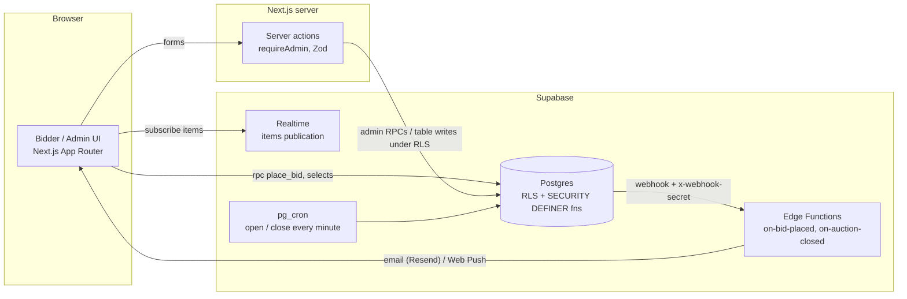
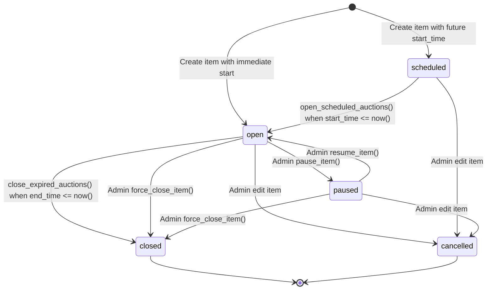

# Hand in Hand Charity Auction

A real-time charity silent auction web application built for Hand in Hand Myanmar events. Designed to run transparently, handle high-concurrency bidding surges with zero race conditions, enforce strict data integrity, and support live updates.

---

## Tech Stack

- **Frontend:** [Next.js 16](https://nextjs.org) (App Router, Turbopack, React 19 Compiler), [Tailwind CSS v4](https://tailwindcss.com), [Base UI](https://base-ui.com), [shadcn/ui](https://ui.shadcn.com), TanStack Query.
- **Backend & Database:** [Supabase](https://supabase.com) (PostgreSQL 17, Row Level Security, `pg_cron`, Realtime, Storage, Edge Functions).
- **Testing & Quality:** [Vitest](https://vitest.dev) for TypeScript unit tests, [pgTAP](https://pgtap.org) for database integrity tests, [Biome](https://biomejs.dev) for linting/formatting.
- **Monitoring:** [Sentry](https://sentry.io) for error tracking.

---

## Getting Started (Local Development)

### Prerequisites

- **Node.js**: v22+
- **pnpm**: v11+
- **Docker**: Docker Desktop or Docker Engine running (for local Supabase)

### Step 1: Clone and install dependencies

```bash
git clone https://github.com/Jpuntul/hand-in-hand-auction.git
cd hand-in-hand-auction
pnpm install
```

### Step 2: Configure environment variables

Copy the example environment file:

```bash
cp .env.example .env.local
```

The defaults in `.env.example` are pre-configured for local Supabase development.

### Step 3: Start the local Supabase stack

```bash
pnpm supabase start
```

This starts PostgreSQL on port 54322, Supabase Studio at `http://127.0.0.1:54323`, and all local services.

### Step 4: Apply database migrations

Run database migrations and seed schemas against your local database:

```bash
pnpm supabase db reset
```

### Step 5: Start the development server

```bash
pnpm dev
```

Open [http://localhost:3000](http://localhost:3000) in your browser.

---

## Documentation & Guides

- **[docs/database.md](docs/database.md)** — Entity-relationship diagram, table purposes, invariants, RPC surface, and the RLS access matrix.
- **[notes/](notes/README.md)** — Changelog of significant changes and decisions (what was done and why).
- **[AUDIT.md](AUDIT.md) / [DB_AUDIT.md](DB_AUDIT.md)** — The engineering and database audits this codebase was remediated against; `todo/` holds the workstream briefs.
- **[ADMIN_SETUP.md](ADMIN_SETUP.md)** — Bootstrapping the initial admin, role management, security guarantees, and dashboard settings.
- **[DEPLOY.md](DEPLOY.md)** — Production deployment to Vercel, environment configuration, Sentry setup, and the pre-event operational checklist.
- **[NOTIFICATIONS_SETUP.md](NOTIFICATIONS_SETUP.md)** — Web push notification setup, VAPID key generation, and Supabase Edge Functions.

---

## Running Tests & Checks

```bash
# Run Vitest unit tests
pnpm test

# Run database pgTAP test suite (requires local Supabase running)
pnpm supabase test db

# Biome code formatting & linting
pnpm biome check src

# TypeScript typechecking
pnpm tsc --noEmit

# Production Next.js build
pnpm build
```

---

## Architecture Overview

The browser talks to Supabase directly (anon key + user JWT); Next.js server actions are used
only for admin/account forms. **Row Level Security is the security boundary, and all auction
money logic lives in Postgres functions** — the app never computes a winner or a current bid.



Repository layout:

```text
src/app/            routes — bidding/, history/[id]/ (item detail), account/, admin/(protected)/
src/lib/auth/       requireAdmin, safeRedirectPath, shared Zod schemas, server-side queries
src/lib/auction.ts  minNextBid / isExpired / formatUsd / STATUS_VARIANT (single source)
src/lib/supabase/   browser + server clients, generated database.types.ts
src/hooks/          useNow (server-corrected clock via NowContext)
supabase/migrations four baseline files — schema, functions, rls, ops (never edit; add on top)
supabase/functions/ Edge Functions + _shared (auth gate, email, push)
supabase/tests/     pgTAP regression tests (run with `supabase test db`)
docs/               database.md (ERD + contracts)
notes/              changelog of significant changes and decisions
todo/               workstream briefs (A–I) and deferred backlog (Z)
```

## Architecture & Business Logic

Core business rules and financial state transitions are enforced at the database level using PostgreSQL `SECURITY DEFINER` functions and row-level locking:

- **Atomic Bid Placement (`place_bid`)**: Located in `supabase/migrations/20260913000100_baseline_functions.sql`. Serializes bids per item via `SELECT ... FOR UPDATE`, validates item status, captures clock timestamp after lock acquisition, enforces a bid jump ceiling (`greatest(min_bid * 10, min_bid + 10000)`), applies anti-snipe deadline extensions (adds 60s if a bid lands in the final 60s), updates item caches, and appends to `bid_history`.
- **Admin Overrides**: Located in `supabase/migrations/20260913000100_baseline_functions.sql`. Provides locking, audited functions for `cancel_last_bid` (soft-cancels newest live bid, recalculates caches, rolls back anti-snipe extensions), `extend_deadline`, `force_close_item`, `pause_item`, and `resume_item`. Direct client updates to derived columns (`current_bid`, `current_bidder_id`, `bid_count`, `winner_*`) are revoked (`20260913000200_baseline_rls.sql`).
- **Automated Lifecycle**: Managed via `pg_cron` minutely jobs calling `open_scheduled_auctions()` (opens items whose `start_time <= now()`) and `close_expired_auctions()` (closes items whose `end_time <= now()` and assigns winners). Paused items are ignored by automated crons.

---

## Lifecycle State Machine



---

## Data Integrity Contract

- **Append-only Bid History:** `public.bid_history` is append-only. Bids are never physically deleted. When a bid is cancelled by an administrator, the row is soft-cancelled by setting `cancelled_at = clock_timestamp()`, `cancelled_by = auth.uid()`, and `cancel_reason`.
- **Derived Column Caches:** The `items.current_bid`, `items.current_bidder_id`, `items.bid_count`, and winner columns are cached values maintained exclusively by atomic SQL functions (`place_bid`, `cancel_last_bid`, `force_close_item`). Direct updates to these columns from PostgREST/clients are forbidden via column privileges.
- **Canonical Ordering:** Accepted bid ordering is strictly `order by id desc` (or `asc`). Serialized sequence `id` guarantees exact resolution order, avoiding clock skew or transaction start timestamp discrepancies.
- **One Database Per Event:** The system operates on an isolated "one database per event" model (DB_AUDIT §5 / OQ-1). An auction instance serves a single charity event, guaranteeing clean accounting, zero cross-tenant data leaks, and simplified point-in-time recovery.
