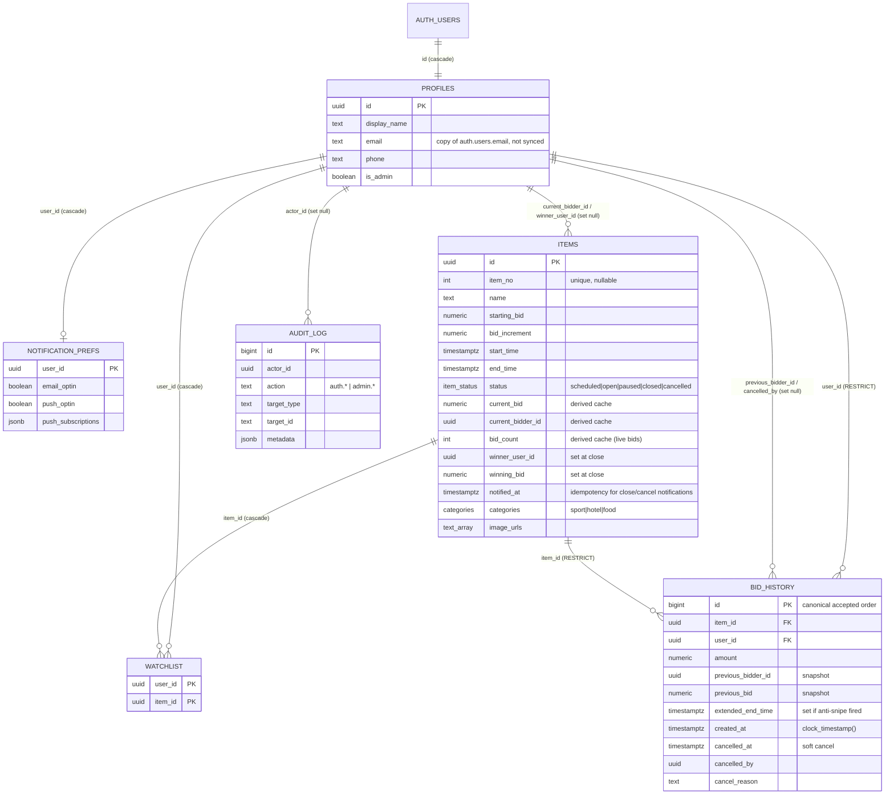
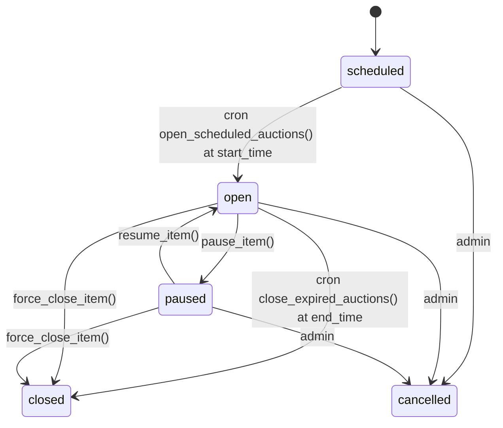

# Database — relationships, contracts, and access rules

Source of truth: `supabase/migrations/20260913000{000,100,200,300}_baseline_*.sql`. This page is
the human-readable map of those four files. If they disagree, the SQL wins — update this page.

- `…000000_baseline_schema.sql` — enums, tables, constraints, indexes, views
- `…000100_baseline_functions.sql` — every function/RPC, triggers, function privileges
- `…000200_baseline_rls.sql` — RLS policies and column-level privileges
- `…000300_baseline_ops.sql` — realtime publication, storage bucket, `pg_cron` jobs, webhooks

## Entity relationship diagram

There is no `events` table: **one database = one auction event**. `items` is both the lot and its
auction. `item_no` is globally unique; the first thing that breaks with a second event is lot
numbering (see `open-questions.md` OQ-1).

## Tables

| Table | Purpose | Written by |
|---|---|---|
| `profiles` | Public extension of `auth.users` + `is_admin` role flag. Created by the `handle_new_user` trigger on signup. | trigger; own-row update (`display_name`, `phone` only); admins |
| `items` | A lot and its auction window, rules, and **derived cache** of the current/winning bid. | admins (details/schedule columns only); `place_bid`, override RPCs and cron for the derived columns |
| `bid_history` | **Append-only** log of every accepted bid. Cancellation is a soft flag, never a delete. Deleting a user or item that has bids is refused (`RESTRICT`). | `place_bid` (insert), `cancel_last_bid` (sets `cancelled_*`) |
| `notification_prefs` | Email/push opt-in and Web Push subscription objects. | own row; Edge Functions (service role) prune dead endpoints |
| `watchlist` | Starred items per user. | own rows |
| `audit_log` | Admin actions and auth events. | `log_audit` RPC (signed-in callers, `^(auth|admin)\.` actions) and the override RPCs; pruned after 90 days |

Views: `public_profiles` (`id, display_name` of every user — the only cross-user read of
`profiles`), `user_bid_counts` (live bids per user), `open_items_revenue`.

## Invariants the database enforces

- `bid_history.amount > 0`; `items.starting_bid > 0`; `items.bid_increment > 0`; `end_time > start_time`.
- `status = 'open'` ⇒ `end_time is not null` (otherwise nothing would ever close it).
- `winner_user_id` / `winning_bid` are null unless `status = 'closed'`, and when closed they equal
  `current_bidder_id` / `current_bid`.
- `bid_count >= 0`; a cancelled bid must carry a non-empty `cancel_reason`.
- **Live bid** = `cancelled_at is null`. `items.bid_count` = number of live bids.
- **Accepted order** = `bid_history.id`. Always `order by id`; `created_at` is for display.
- Derived `items` columns (`current_bid`, `current_bidder_id`, `bid_count`, `winner_user_id`,
  `winning_bid`) are not updatable by `authenticated` at all (column privileges) — only the
  `SECURITY DEFINER` functions below change them.

## Functions (RPC surface)

| Function | Callable by | What it does |
|---|---|---|
| `place_bid(item_id, amount)` | authenticated | Locks the item row, validates status/window/minimum, rejects jumps above `greatest(min×10, min+10 000)`, applies anti-snipe (+60 s if within the last 60 s), updates the cache, inserts the bid. Uses `clock_timestamp()` after the lock. |
| `pause_item`, `resume_item`, `extend_deadline(minutes)`, `force_close_item`, `cancel_last_bid(reason)` | authenticated (each checks `is_admin()` inside) | Atomic admin overrides; each locks the row, validates the transition, writes an `audit_log` row in the same transaction. `cancel_last_bid` soft-cancels the newest live bid, recomputes the cache from live rows, rolls back an anti-snipe extension, and refreshes `winner_*` on closed items. |
| `open_scheduled_auctions()`, `close_expired_auctions()` | cron only | Lifecycle, every minute (`auction-lifecycle` job). Paused items are ignored by both. |
| `log_audit(action, target_type, target_id, metadata)` | authenticated | Append an audit row; actor email resolved server-side. |
| `server_time()` | anon, authenticated | DB clock for client countdowns. |
| `is_admin()` | authenticated | Used by RLS policies. |
| `install_notification_webhooks()` | migration / admin SQL | (Re)creates the two triggers that POST to the Edge Functions with the Vault `webhook_secret`. |

Everything else has `EXECUTE` revoked from `public`/`anon`, and default privileges are set so new
functions are private until explicitly granted.

## Access matrix (RLS + privileges)

| Object | anon | bidder | admin |
|---|---|---|---|
| `profiles` | — | own row (read; update `display_name`, `phone`) | all rows |
| `public_profiles` | read | read | read |
| `items` | read | read | read/insert/delete; update editable columns only |
| `bid_history` | read | read | read (no delete — soft-cancel via RPC) |
| `notification_prefs` | — | own row | own row |
| `watchlist` | — | own rows | own rows |
| `audit_log` | — | — | read |
| storage `item-images` | read | read | write |

Bidder UUIDs on `items`/`bid_history` are public by design; they resolve only to display names.

## Lifecycle

`closed → cancelled` is not possible from the UI today (the winner columns would have to be
nulled in the same statement and they are not client-writable); add a `cancel_item()` RPC if
needed (`backlog.md`).

## Side effects

- **Realtime:** `items` is in the `supabase_realtime` publication (full-row updates to every
  client). `bid_history` is not.
- **Webhooks → Edge Functions:** `bid_history` insert → `on-bid-placed` (outbid notice);
  `items` status change → `on-auction-closed` (won/lost or cancelled notices, once per item via
  `notified_at`). Both require the `x-webhook-secret` header.
- **Cron:** `auction-lifecycle` (every minute), `audit-log-retention` (03:00 daily, 90 days).

## Further reading

- `open-questions.md` — organiser decisions this design assumes (currency, second event,
  self-outbid, runner-up winner, erasure path). `backlog.md` — deferred work.
- The audits that produced this design (`AUDIT.md`, `DB_AUDIT.md`, `todo/`) were removed from
  the tree to keep it clean; see git commit `8c6faa5`.
- `notes/2026-09-13-changes.md` — what changed and why, per workstream.
- `supabase/tests/*.sql` — pgTAP tests that pin every invariant above.
